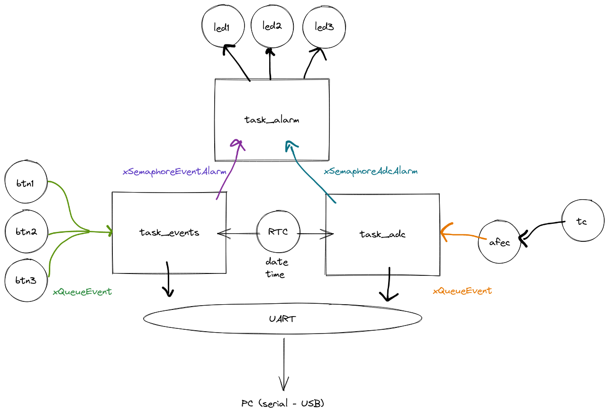

# 22a - EMB - AV2

- A prova é prática, com o objetivo de avaliar sua compreensão a cerca do conteúdo ministrado pela disciplina. 
- É permitido consulta a todo material pessoal (suas anotações, códigos) e publico (github e internet), mas não pode consultar outros alunos.
- **Lembre que e' boa prática a cada 30 minutos fazer um commit no seu código!**
- Duração total: 2h + 1h extra

> 1. A avaliação do conceito C deve ser feita em sala de aula por um dos membros da equipe
> 2. A entrega do projeto deve ser feita no git
> 3. ⚠️ Fazer o envio pelo forms:
>   - https://docs.google.com/forms/d/e/1FAIpQLScG1W5NKQ9MjmJJzgQ9pYsm_kYpOAp-WqrbqLF-3M7o9lyxCQ/viewform?usp=sf_link

**Você vai precisar:**

- ▶️ Kit SAME70-XPLD
- ▶️ Conectar o OLED1 ao EXT-1
- ▶️ Conectar o Potenciômetro no pino PD30

**Periféricos que vai precisar utilizar:**

- Botões e Leds (OLED)
- PIO
- TC
- RTC
- Uart console (printf)

**Código exemplo fornecido:**

No código fornecido (e que deve ser utilizado) os botões e LEDs da placa OLED já foram inicializados na função (io_init) e os callbacks dos botões já estão configurados. Temos uma task_oled que é inicializada e fica exibindo no OLED um ponto piscando. Pedimos para não mexer nessa task, pois ela serve de debug para sabermos se seu programa travou (se parar de piscar tem alguma coisa errado com o seu programa).

## Descritivo

Vamos criar um protótipo de um dataloger, um sistema embarcado coleta periodicamente valores e eventos do mundo real, formata e envia para um dispositivo externo. O envio da informação será feito pela UART. O dataloger também irá verificar algumas condições de alarme .

### Visão geral do firmware



O firmware vai ser composto por três tasks: `task_adc`, `task_events` e `task_alarm` além de duas filas: `xQueueEvent` e `xQueueADC` e dois semáforos: `xSemaphoreEventAlarm` e `xSemaphoreAfecAlarm`. A ideia é que a cada evento de botão ou a cada novo valor do ADC um log formatado seja enviado pela UART (`printf`) e uma verificação das condições de alarme checadas, se um alarme for detectado a `task_alarm` deve ser iniciada. O log que será enviado pela UART deve possuir um timestamp que indicará quando o dado foi lido pelo sistema embarcado (DIA:MES:ANO HORA:MINUTO:SEGUNDO).

A seguir mais detalhes de cada uma das tarefa:

### task_adc

| Recurso               | Explicacao                                           |
|-----------------------|------------------------------------------------------|
| RTC                   | Fornecer as informacões do TimeStamp                 |
| TC                    | Gerar o 1hz do AFEC                                  |
| AFEC                  | Leitura analógica                                    |
|-----------------------|------------------------------------------------------|
| `xQueueAFEC`          | Recebimento do valor do ADC                          |
| `xSemaphoreAfecAlarm` | Liberação da `task_alarm` devido a condição de alarm |

A `task_adc` vai ser responsável por coletar dados de uma entrada analógica via AFEC (usando algum TC para a base de tempo), os dados devem ser enviados do *callback* do AFEC via a fila `xQueueADC` a uma taxa de uma amostra por segundo (1hz). A cada novo dado do AFEC a condição de alarme deve ser verificada.

A task, ao receber os dados deve realizar a seguinte ação:

1. Enviar pela UART o novo valor no formato a seguir:
    - `[AFEC ] DD:MM:YYYY HH:MM:SS $VALOR` (`$VALOR` deve ser o valor lido no AFEC)
1. Verificar a condicão de alarme:
    - 5 segundos com AFEC maior que 3000
    
Caso a condição de alarme seja atingida, liberar o semáforo `xSemaphoreAfecAlarm`.

### task_event 

| Recurso                | Explicacao                                           |
|------------------------|------------------------------------------------------|
| RTC                    | Fornecer as informações do TimeStamp                 |
| PIO                    | Leitura dos botões                                   |
|------------------------|------------------------------------------------------|
| `xQueueEvent`          | Recebimento dos eventos de botão                     |
| `xSemaphoreEventAlarm` | Liberação da `task_alarm` devido a condição de alarm |


A `task_event` será responsável por ler eventos de botão (subida, descida), para isso será necessário usar as interrupções nos botões e enviar pela fila `xQueueEvent` o ID do botão e o status (on/off). A cada evento a task deve formatar e enviar um log pela UART e também verificar a condição de alarme.

A task, ao receber os dados deve realizar a seguinte ação:

1. Enviar pela UART o novo valor no formato a seguir:
    - `[EVENT] DD:MM:YYYY HH:MM:SS $ID:$Status`L
        - `$ID`: id do botão (1,2,3)
        - `$status`: 1 (apertado), 0 (solto)
1. Verificar a condicão de alarme:
    - Dois botões pressionados ao mesmo tempo
    
Caso a condição de alarme seja atingida, liberar o semáforo `xSemaphoreEventAlarm`.

### task_alarm

| Recurso                | Explicacao                                 |
|------------------------|--------------------------------------------|
| PIO                    | Acionamento dos LEDs                       |
|------------------------|--------------------------------------------|
| `xSemaphoreAfecAlarm`  | Indica alarme ativado devido a task_afec  |
| `xSemaphoreEventAlarm` | Indica alarme ativado devido a task_event |

Responsável por gerenciar cada um dos tipos de alarme diferente: `afec` e `event`. A cada ativacão do alarme a task deve emitir um Log pela serial, O alarme vai ser um simples pisca LED, para cada um dos alarmes vamos atribuir um LED diferentes da placa OLED: 

- `EVENT`: LED1
- `AFEC `: LED2

Os alarmes são ativos pelos semáforos `xSemaphoreAfecAlarm` e `xSemaphoreEventAlarm`. Uma vez ativado o alarme o mesmo deve ficar ativo até a placa reiniciar.

Ao ativar um alarme, a `task_alarm` deve emitir um log pela serial no formato descrito a seguir:

- `[ALARM] DD:MM:YYYY HH:MM:SS $Alarm` (onde `$Alarm` indica qual alarme que foi ativo).

### Exemplo de log

A seguir um exemplo de log, no caso conseguimos verificar a leitura do AFEC e no segundo 04 o botão 1 foi pressionado, e depois solto no segundo 05. No segundo 06 o AFEC atinge um valor maior que o limite e fica assim por mais 10 segundos, ativando o alarme no segundo 14.

``` 
 [AFEC ] 19:03:2018 15:45:01 1220
 [AFEC ] 19:03:2018 15:45:02 1222
 [AFEC ] 19:03:2018 15:45:03 1234
 [AFEC ] 19:03:2018 15:45:04 1225
 [EVENT] 19:03:2018 15:45:04  1:1
 [AFEC ] 19:03:2018 15:45:04 1245
 [AFEC ] 19:03:2018 15:45:05 1245
 [EVENT] 19:03:2018 15:45:05  1:0
 [AFEC ] 19:03:2018 15:45:06 4000
 [AFEC ] 19:03:2018 15:45:07 4004
 [AFEC ] 19:03:2018 15:45:08 4002
 [AFEC ] 19:03:2018 15:45:08 4001
 [AFEC ] 19:03:2018 15:45:08 4001
 [ALARM] 19:03:2018 15:45:09 AFEC
```

### Resumo

A seguir um resumo do que deve ser implementando:

- Leitura do AFEC via TC 1hz e envio do dado para fila `xQueueAfec`
- Leitura dos botões do OLED via IRQ e envio do dado para fila `xQueueEvent`
- `task_afec`
    - log:  `[AFEC ] DD:MM:YYYY HH:MM:SS $VALOR` 
    - alarm se valor afec maior que 3000 durante 10s
        - libera semáforo `xSemaphoreAfecAlarm`
- `task_event`
    - log:  `[EVENT] DD:MM:YYYY HH:MM:SS $ID:$STATUS` 
    - alarm se dois botões pressionados ao mesmo tempo
        - libera semáforo `xSemaphoreEventAlarm`
- `task_alarm`
    - verifica dois semáforos: `xSemaphoreEventAlarm` e `xSemaphoreAfecAlarm`
    - recebido um semáforo gear o log:  `[ALARM] DD:MM:YYYY HH:MM:SS $ALARM` 
    - Pisca led 1 dado se alarm AFEC ativo `xSemaphoreAfecAlarm`
    - Pisca led 2 dado se alarm EVENT ativo

Não devem ser utilizadas variáveis globais além das filas e semáforos.

### Dicas

Comeće pela `task_event` depois faća a `task_afec` e então a `task_alarm`.

### Binário exemplo

No repositório tem o binário da solução ([solucao.elf](https://github.com/insper-classroom/22a-emb-av2/blob/main/solucao.elf)) que deve ser implementada, indicamos que todos rodem antes de comecarem a resolução da avaliaćão. 

Lembrem de abrir o terminal do Microchip Studio para ver as informações de debug.

Se você não lembra como fazer isso, assista ao vídeo a seguir:

- https://www.youtube.com/watch?v=yAgsnUbYcWk

## Entrega

1. A apresentação do conceito C deve ser feita em sala de aula por um dos membros da equipe
2. A avaliação do projeto deve ser feita no git
3. ⚠️ Fazer o envio pelo forms:
   - https://docs.google.com/forms/d/e/1FAIpQLScG1W5NKQ9MjmJJzgQ9pYsm_kYpOAp-WqrbqLF-3M7o9lyxCQ/viewform?usp=sf_link

### Ganhando conceitos

Você pode fazer qualquer combinacão dos itens a seguir para melhorar sua nota, cada item possui um acréscimo no conceito:

- (meio conceito) Exibir no OLED um logs simplificado (um por linha):
    ```  
    mm:ss AFEC
    mm:ss Event
    ```
- (meio conceito) Quanto ativado o LED devido a um alarme (event e afec), pisca usando os TCs
- (meio conceito) Adicionar mais um botão externo a placa (usando protoboard)
- (meio conceito) Desligar o alarme do AFEC se ele passar 10 segundos em um valor menor que 1000
- (meio conceito) No lugar do TC do AFEC use um RTT
- (meio conceito) Usa MUTEX no acesso ao printf
- (um conceito) Adicionar mais um AFEC (nova task)
- (um conceito) Desligar o alarme por um comando da UART
    - receber o valor `a` desliga o alarme do AFEC
    - receber o valor `e` desliga o alarme de EVENT
